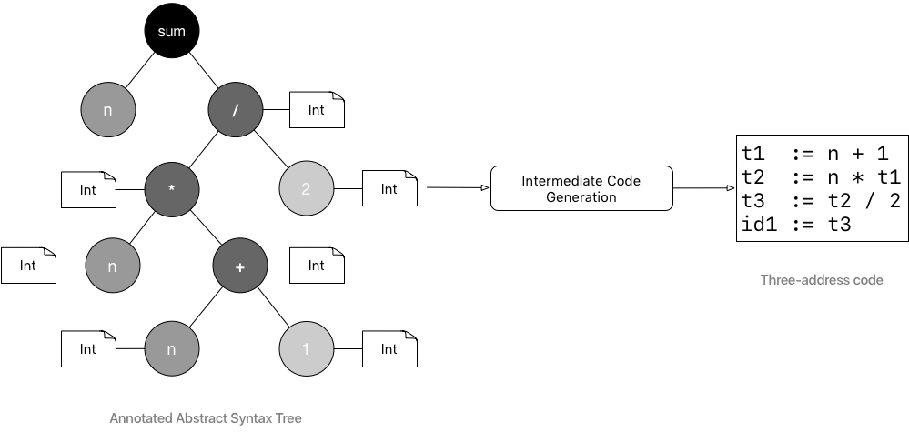

# What is this?
This is an implementation of a compiler for a programming language called <b>Blink</b> described in the medium blog series : https://hackernoon.com/lets-build-a-programming-language-2612349105c6

## Features of Blink:
* Object-oriented.
* Statically-typed.

## Overview of Blink:
* <b>Datatypes</b>: int, float, bool, string. All types inherit from supertype <b>Object</b>.
* <b>Let expressions to declare variables</b>: 
```
let message: String = "Hello, Blink!" in {
    Console.println(message)
}
```
* <b>Omitting the curly braces</b>: Whenever the body contains a single expression the curly braces around the body can be omitted.
* <b>Functions</b>: 
```
func sum(a: Int, b: Int): Int = {
    a + b
}
```
```
func sum(a: Int, b: Int) = a + b
```
* <b>Classes</b>: all non-function properties are private and all function properties are public, getters and setters to access non-function properties
```
class Person {
    //non-function properties
    var firstname: String = "Klaus"
    var lastname: String
    var age: Int

    //getter
    func firstname(): String = {
        firstname
    }

    //setter
    func setFirstname(name: String) = {
        firstname = name
    }
}

let p = new Person() in { }
```
* <b>Constructors, inheritence, overriding</b>:
> 1. constructors:
```
class Person(firstname: String, lastname: String) {
    func firstname(): String = firstname
    func setFirstname(name: String) = firstname = name
    func lastname(): String = lastname
    func setLastname(name: String) = lastname = name
}
```
> 2. inheritence:
```
class Employee(firstname: String, lastname: String) extends Person(firstname, lastname) {
}
```
> 3. overriding:
```
class Person(firstname: String, lastname: String) {
    override func toString(): String = {
        firstname + " " + lastname
    }
}
```
* <b>Everything is an object</b>: Everything is an object. primitives like int's and double's are also objects. 1 + 2 is evaluated as 1.+(2). This is awesome feature which enables us to define operators to custom types.
* <b>There is no statement, only expressions and definitions</b>
The difference b/w an expression and a statement is that an expression always evaluates to a value but a statement just performs an action without evaluating to a value.
In javaScript:
```
if (<some condition>) {
    // some code that is evaluated
}
```
This is an if-statement, it does not evaluate to a value.
In Blink:
```
let isAnAdult = if(age >= 18) { true } else { false }
```
This is an if-expression, it evaluates to a boolean type value, so this if-expression can be used anywhere an expression can be used, like in an variable declaration.


## Stages the source code goes through in a compiler.


## Lexical Analysis:
Source code is analyzed for lexemes, which are meaningfull elements in the source language like <b>func, if, while, identifiers, strings, numbers, operators, single characters like { [ ; : , . etc.</b>.
> <b>A <i>lexeme</i> is uniquely identifiable string of characters in a source language</b>

From lexemes a sequence of tokens is generated.

> <b>A <i>token</i> is an object describing a <i>lexeme</i>.Along with the value of the lexeme (the actual string of characters) it contains information such as its type - <i>is it a keyword? is it a identifier? an operator?</i> and the position in source code where it appears (row number/ column number)</b>

If the compiler comes a string of characters it cannot identify as a meaningfull element of the source language it will throw an error and stop its execution.


## Syntax Analysis
This phrase takes the tokens generated by the lexical analysis and creates a data structure called an <b><i>Abstract syntax tree</i></b>. This tree reflects the syntactic structure of the code.


In this phrase
* Syntax errors are found and reported to the user in the form of error messages which contain a description of the error and the line number in the file where that error occured.

## Semantic Analysis
This phrase takes the AST from the syntax analysis and creates an <i><b>Annotated AST and a Symbol table</b></i>.


> This phrase checks if the program is consistent with all the semantic rules of the source language.

* <b>Type inferrence</b>: If the language supports type inference, then the compiler tries to infer the types of all untyped expressions in the program. After successfully inferring the type, the compiler will annotate the corresponding node in the AST with the inferred type information.

* <b>Type checking</b>: Type checking happens.

* <b>Symbol management</b>: The compiler maintains a data structure called a <b>Symbol table</b> which contains information about all the names(symbols) in the program. Using the symbol table the compiler can query various types of questions like
    > * Is the variable declared before use?
    > * Are there two variables with the same name in the same scope?
    > * What is the type of this variable?
    > * Is this variable available in the current scope?


## Intermediate code generation
This phrase takes in the <i>Annotated AST</i> from the semantic analysis and produces an intermediate machine-independent low-level code. <b><i>Three-address code</i></b> is one such type of code.

> 3AC in it's simplest form is a language in which an instruction is an assignment and has at most 3 parts.

```
a:= b <operator> c or a:= b
```



## Optimization
This phrase takes the 3AC code and tries to optimize by making it shorter or faster. A simple optimization would be remove temporary assignments from the 3AC code.


## Code generation
This phrase takes the optimized intermediate code and translates it into machine-dependent code, assembly, or any other target low-level language.


## Compiler vs Interpreter
> An interpreter will take the source code and generate an intermediate representation which can either be an AST, Annotated AST or the 3AC code and <b><i>immediately evaluate it</i></b>.

> A compiler will translate the source code into efficient machine code. The machine code can evaluated later and is not the job of the compiler to do so.